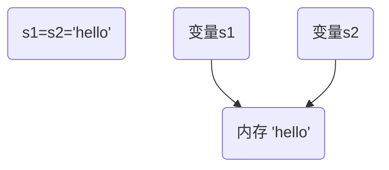

# 复习

typora: https://typora.io/linux/Typora-linux-x64.tar.gz

## 笔试题型

- 编码：一般来说，10行以内
- 读代码：程序功能？输出？

## 面试题复习

### 求和

```python
>>> sum100 = 0
>>> for i in range(1, 101): sum100 += i
```

```python
>>> sum100 = 0
>>> counter = 1
>>> while counter < 101:
...     sum100 += counter
...     counter += 1
... 
>>> sum100
5050
```

```python
>>> sum(range(1, 101))
5050
```

### 数据类型的分类

#### 按存储模型分为

- 标量：数字、字符串
- 容器：列表、元组、字典

#### 按更新模型分为

- 可变：列表、字典
- 不可变：数字、字符串



#### 按访问模型

- 直接访问：数字
- 顺序访问：字符串、列表、元组
- 映射访问：字典

### 函数内修改全局变量

```python
>>> a = 5
>>> def fn():
...     a = 10
...     print(a)
... 
>>> fn()
10
>>> a
5
>>> def fn2():
...     global a
...     a = 10
...     print(a)
... 
>>> fn2()
10
>>> a
10
```

### 字典

```python
>>> adict = {'name': 'tom', 'age': 20}
>>> bdict = {'qq': '123456', 'email': 'tom@tedu.cn'}
>>> adict.update(bdict)
>>> adict
{'name': 'tom', 'age': 20, 'qq': '123456', 'email': 'tom@tedu.cn'}
>>> del adict['qq']
>>> adict
{'name': 'tom', 'age': 20, 'email': 'tom@tedu.cn'}
>>> adict.pop('age')
20
>>> adict
{'name': 'tom', 'email': 'tom@tedu.cn'}
```

### GIL

GIL 是python的全局解释器锁，同一进程中假如有多个线程运行，一个线程在运行python程序的时候会霸占python解释器（加了一把锁即GIL），使该进程内的其他线程无法运行，等该线程的:smile:***时间片***:smile:用完了，它将排到队尾，下一个线程就可以使用解释器了。

### 消除重复数据

```python
>>> from random import randint
>>> nums = [randint(1, 10) for i in range(20)]
>>> nums
[2, 4, 4, 5, 6, 8, 3, 8, 8, 9, 4, 9, 10, 1, 10, 10, 9, 9, 1, 8]
>>> set(nums)
{1, 2, 3, 4, 5, 6, 8, 9, 10}
>>> list(set(nums))
[1, 2, 3, 4, 5, 6, 8, 9, 10]
###########################################
>>> result = []
>>> for i in nums:
...     if i not in result:
...         result.append(i)
... 
>>> result
[2, 4, 5, 6, 8, 3, 9, 10, 1]
```

### 参数个数不确定的函数

#### 定义函数

- 参数前加\*表示参数是元组：\*args
- 参数前加\*\*表示参数是字典：\*\*kwargs

#### 调用函数

- 在序列对象前加\*，表示把序列对象拆开

```python
>>> s1 = 'abc'
>>> func(*s1)  => func('a', 'b', 'c'）
```

- 在字典前加\*\*，表示把字典拆开

```python
>>> adict
{'name': 'tom', 'em': 'tom@tedu.cn'}
>>> func(**adict)  => func(name='tom', em='tom@tedu.cn')
```

### 列表[1,2,3,4,5],请使用map()函数输出[1,4,9,16,25]，并使用列表推导式提取出大于10的数，最终输出[16,25]

```python
>>> nums = list(range(1, 6))
>>> nums
[1, 2, 3, 4, 5]
>>> alist = list(map(lambda x: x ** 2, nums))
>>> alist
[1, 4, 9, 16, 25]
>>> [i for i in alist if i > 10]
[16, 25]
```


