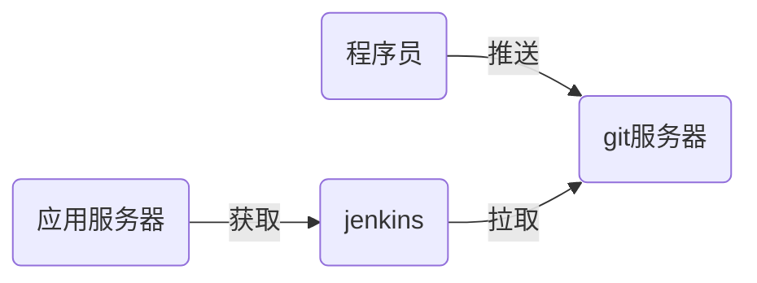

# devops03

## zabbix编程

官方手册页：https://www.zabbix.com/documentation/3.4/zh/manual

如果zabbix页面放到了 /var/www/html/zabbix中，那么，api的地址是：http://x.x.x.x/zabbix/api_jsonrpc.php 

### zabbix编程：

1. 不需要认证的资源直接获取
2. 需要认证的资源，需要先取得token（授权），对zabbix操作时，出示token

## CI/CD：持续集成/持续交付

- 虚拟机1：模拟程序员的客户端，用于编写程序
- 虚拟机2：用于gitlab服务器，通过容器实现
- 虚拟机3：用于jenkins服务器，需要可以接入互联网



- 程序编写代码，并通过git管理

```shell
# 安装git
[root@node5 ~]# yum install -y git
# 配置git
[root@node5 ~]# git config --global user.name 'Mr.zzg'
[root@node5 ~]# git config --global user.email 'zzg@tedu.cn'
[root@node5 ~]# git config --global core.editor vim
# 初始化项目
[root@node5 ~]# git init myweb
[root@node5 ~]# cd myweb
[root@node5 myweb]# echo '<h1>my web site</h1>' > index.html
[root@node5 myweb]# git add .
[root@node5 myweb]# git commit -m "my web 1.0"
[root@node5 myweb]# git tag 1.0
```

- 在gitlab中创建名为myweb的项目，配置用户为主程序员
  - 项目：软件项目
  - 组：对应开发团队
  - 成员：

- 程序员配置免密上传代码

- 配置jenkins

```shell
[root@node7 ~]# rpm -ihv jenkins-2.177-1.1.noarch.rpm 
[root@node7 ~]# systemctl start jenkins
访问http://192.168.4.7:8080/ 配置jenkins
根据向导初始化时，不要在线装插件，因为访问外网太慢
不要创建新用户，使用admin即可
进入界面后，第一件事是改密码 右上角admin -> configure
```

- 安装插件

```shell
# 使用清华大学镜像站点作为源
首页 -> Manage Jenkins -> Manage Plugins -> Advanced -> Update Site -> https://mirrors.tuna.tsinghua.edu.cn/jenkins/updates/update-center.json -> submit
# 安装插件
Available -> git parameter / Localization: Chinese (Simplified) -> install without restart -> Restart Jenkins when installation is complete and no jobs are running
```

- jenkins拉取代码，注意jenkins服务器上要安装了git

```shell
[root@node7 ~]# yum install -y git
首页 -> 新建Item -> website / Freestyle project -> 添加参数 -> git parameter => name: webver / Parameter Type: Branch or Tag / Default Value: origin/master -> 源码管理 -> Git => Repository URL: http://192.168.4.6/devops/website.git / Branches to build: ${webver} -> 保存
构建工程时，代码默认下载到/var/lib/jenkins/workspace/目录
```

- 修改jenkins工程，下载软件时，将不同版本放到不同的目录中。下载后的软件打包压缩 ，并放到apache根目录下，方便应用服务器获取。创建版本文件，说明最新的软件版是哪一个，以及前一个版本

```shell
[root@node7 ~]# rm -rf /var/lib/jenkins/workspace/website/
[root@node7 ~]# yum install -y httpd
[root@node7 ~]# mkdir -p /var/www/html/deploy/pkgs
[root@node7 ~]# chown -R jenkins.jenkins /var/www/html/deploy/
修改jenkins工程
Additional Behaviours -> 新增步骤=> checkout to a sub-directory: myweb-${webver}
构建 -> Execute shell :
pkg_dir=/var/www/html/deploy/pkgs
cp -r myweb-${webver} $pkg_dir  # 将软件目录拷贝到apache目录下
cd $pkg_dir
rm -rf myweb-${webver}/.git  # 删除版本库文件
tar caf myweb-${webver}.tar.gz myweb-${webver}  # 打包软件
rm -rf myweb-${webver}   # 删除软件目录，只保留压缩包
md5sum myweb-${webver}.tar.gz | awk '{print $1}' > myweb-${webver}.tar.gz.md5   # 计算压缩包的md5值
cd ..
[ -f livever ] && cat livever > lastver  # 将当前版本写到lastver文件中
echo ${webver} > livever
```

## ansible

```python
(weekend1) [root@room8pc16 devops03]# pip install zzg_pypkgs/ansible_pkg/*
```

执行管理操作的方法

- adhoc临时命令
- playbook

```shell
(weekend1) [root@room8pc16 devops03]# mkdir myansible
(weekend1) [root@room8pc16 devops03]# cd myansible
(weekend1) [root@room8pc16 myansible]# vim ansible.cfg
[defaults]
inventory = hosts
remote_user = root
(weekend1) [root@room8pc16 myansible]# vim hosts
[dbservers]
192.168.4.5

[webservers]
192.168.4.7

# adhoc
(weekend1) [root@room8pc16 myansible]# ansible all -m ping -k
# 免密登陆
(weekend1) [root@room8pc16 myansible]# ssh-copy-id 192.168.4.5
(weekend1) [root@room8pc16 myansible]# ssh-copy-id 192.168.4.7

# playbook
(weekend1) [root@room8pc16 myansible]# vim lamp.yml
---
- name: configure dbservers
  hosts: dbservers
  tasks:
  - name: install db pkgs
    yum:
      name: mariadb-server
      state: latest
  - name: start db srv
    service:
      name: mariadb
      state: started
      enabled: yes

- name: configure webservers
  hosts: webservers
  tasks:
  - name: install web pkgs
    yum:
      name: [httpd, php, php-mysql]
      state: latest
  - name: start web srv
    service:
      name: httpd
      state: started
      enabled: yes
```

## ansible-api

ansible手册：https://docs.ansible.com/ansible/2.7/index.html

搜索python api

playbook -> python数据类型

```ymal
---
- name: configure dbservers
  hosts: dbservers
  tasks:
  - name: install db pkgs
    yum:
      name: mariadb-server
      state: latest
  - name: start db srv
    service:
      name: mariadb
      state: started
      enabled: yes

- name: configure webservers
  hosts: webservers
  tasks:
  - name: install web pkgs
    yum:
      name: [httpd, php, php-mysql]
      state: latest
  - name: start web srv
    service:
      name: httpd
      state: started
      enabled: yes
```

```python
[
    {'name': 'configure dbservers'},
    {'hosts': 'dbservers'},
    {
        'tasks': {[
            {'name': 'install db pkgs'},
            {'yum': {'name': 'mariadb-server', 'state': 'latest'}},
        ],
            [
                {'name': 'start db srv'},
                {'service': {'name': 'mariadb', 'state': 'started',, 'eanbled': 'yes'}}
            ],
        },
        
    },
]
```

ansible模块（了解）

```shell
# 创建自定义模块路径
# mkdir /tmp/libs
# export ANSIBLE_LIBRARY=/tmp/libs
# vim /tmp/libs/rcopy.py
import shutil
from ansible.module_utils.basic import AnsibleModule

def main():
    module = AnsibleModule(
        argument_spec=dict(
            yuan=dict(required=True, type='str'),
            mubiao=dict(required=True, type='str')
        )
    )
    shutil.copy(module.params['yuan'], module.params['mubiao'])
    module.exit_json(change=True)

if __name__ == '__main__':
    main()
    
(weekend1) [root@room8pc16 myansible]# ansible webservers -m rcopy -a "yuan=/etc/hosts mubiao=/tmp/zj.txt"
```

ansible-cmdb: 将收集到的主机信息生成web页面

```shell
# 收集主机信息，放到/tmp/out/目录
(weekend1) [root@room8pc16 myansible]# ansible all -m setup --tree /tmp/out
# 安装ansible-cmdb
(weekend1) [root@room8pc16 myansible]# pip install  zzg_pypkgs/ansible-cmdb_pkgs/*
# 使用ansible-cmdb生成web页面
[root@room8pc16 myansible]# ansible-cmdb /tmp/out/ > /tmp/hosts.html
# firefox /tmp/hosts.html

```


