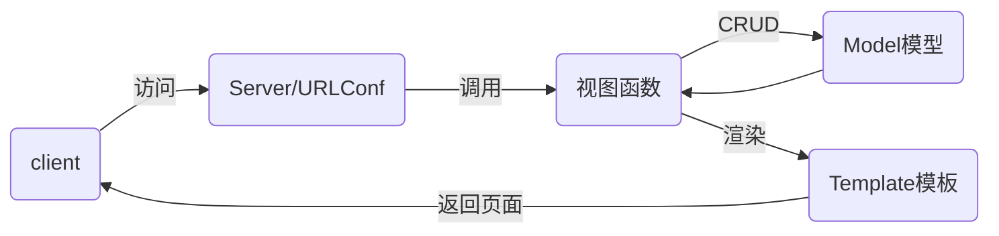

# weekend_devweb02

## boostrap

视频网址：https://www.bilibili.com/video/av9072269?from=search&seid=13256178968061199088

- twitter公司的开源前端web框架
- 简单来说，它就是一个大样式表文件
- Bootstrap 是最受欢迎的 HTML、CSS 和 JS 框架，用于开发响应式布局、移动设备优先的 WEB 项目。

bootstrap官方中文站：https://www.bootcss.com/

### 颜色

- muted柔和灰
- success成功绿
- danger危险红
- warning警告黄
- primary首要蓝
- info信息蓝

### 表单

- 为了各组件之间有一定的间距，需要把它们放到不同的div中，类名form-group
- 文本型的控件类名为form-control

### 栅格系统

- 实现布局
- 首选需要一个class为container的div
- 再将屏幕的一行做为一个row，也就是container中所有的内容再放到class为row的div中
- 每个row最多分为12列，row中的div可以设置占几列


## DJANGO

- django是Python语言编写的一个web框架
- 其他的框架还有flask和tornado

### 配置django

```shell
# 安装方法一：离线安装
(weekend1) [root@room8pc16 devweb02]# pip install zzg_pypkgs/dj_pkgs/*

# 安装方法二：在线安装
(weekend1) [root@room8pc16 devweb02]# pip install django==1.11.6

# 创建项目方法一：通过django命令
(weekend1) [root@room8pc16 devweb02]# django-admin startproject mytest

# 创建项目方法二：通过pycharm创建
File -> New project -> 选左窗格的Django，右窗格注意选对解释器


# 启动测试服务器
(weekend1) [root@room8pc16 mysite]# python manage.py runserver
# 访问127.0.0.1:8000

# django初始化项目文件说明
(weekend1) [root@room8pc16 mysite]# tree .
.                          # 项目的根目录
├── db.sqlite3             # 文件型数据库，一个文件就是一个数据库
├── manage.py              # 项目管理文件
├── mysite                 # 项目配置目录
│   ├── __init__.py        # 项目初始化文件
│   ├── settings.py        # 配置文件
│   ├── urls.py            # 程序的入口文件，路由映射文件
│   └── wsgi.py            # 部署项目到web服务器时使用
└── templates              # 存储网页模板的目录
```

### MTV设计模式

- M：Model模型，数据库
- T：Template模板，网页
- V：Views视图，函数



### 创建数据库

```shell
[root@room8pc16 devweb02]# mysql -uroot -ptedu.cn
MariaDB [(none)]> CREATE DATABASE wnsd1_dj DEFAULT CHARSET utf8;
```

### 修改项目配置文件

```shell
# mysite/settings.py
ALLOWED_HOSTS = ['*']
DATABASES = {
    'default': {
        'ENGINE': 'django.db.backends.mysql',
        'NAME': 'wnsd1_dj',
        'USER': 'root',
        'PASSWORD': 'tedu.cn',
        'HOST': '127.0.0.1',
        'PORT': '3306',
    }
}
LANGUAGE_CODE = 'zh-hans'
TIME_ZONE = 'Asia/Shanghai'
USE_TZ = False
```

### 修改初始化文件

```shell
# mysite/__init__.py
import pymysql
pymysql.install_as_MySQLdb()
```

### 再次启动开发服务器，监听在0.0.0.0:80上

```shell
# python manage.py runserver 0:80
```

### 生成数据库文件

每个项目默认都集成了一部分django自带的应用，这些应用需要数据库

```shell
(weekend1) [root@room8pc16 mysite]# python manage.py makemigrations
(weekend1) [root@room8pc16 mysite]# python manage.py migrate
```

### 生成管理员帐号

```shell
(weekend1) [root@room8pc16 mysite]# python manage.py createsuperuser
```

### 打开后台管理界面

访问：http://x.x.x.x/admin


## 编写投票应用

- 程序项目由多个功能模块构成

1. 创建应用polls

```shell
(weekend1) [root@room8pc16 mysite]# python manage.py startapp polls
```

2. 将应用集成到项目

```shell
# mysite/settings.py
INSTALLED_APPS = [
    ... ...
    'polls',
]
```

3. 规划url

- http://x.x.x.x/polls/ : 用于显示所有的投票问题
- http://x.x.x.x/polls/1/ : 显示1号问题详情
- http://x.x.x.x/polls/1/result : 显示1号问题投票结果

4. 授权：将polls应用的url交给polls应用处理

```shell
# mysite/urls.py
from django.conf.urls import url, include
from django.contrib import admin

urlpatterns = [
    url(r'^admin/', admin.site.urls),
    url(r'^polls/', include('polls.urls')),
]

# polls/urls.py
from django.conf.urls import url

urlpatterns = [
    
]

```

5. 编写url

```shell
from django.conf.urls import url
from . import views   # 相对导入，从当前目录中导入views模块

urlpatterns = [
    # 当访问应用首页时，用views.index函数处理
    # 该url(http://x.x.x.x/polls/)命名为index
    url(r'^$', views.index, name='index'),
    # 通过正则\d+匹配数字，再将这个数字作为vies.detail的参数
    url(r'^(\d+)/$', views.detail,name='detail'),
    url(r'^(\d+)/result/$', views.result, name='result'),
]
```

6. 编写函数

```shell
# polls/views.py
from django.shortcuts import render

# Create your views here.

def index(request):
    # 函数至少有一个参数，用户的请求将会自动发给它
    return render(request, 'index.html')

def detail(request, question_id):
    # 返回的字典，key将成为模板的变量，val是值
    return render(request, 'detail.html', {'question_id': question_id})

def result(request, question_id):
    return render(request, 'result.html', {'question_id': question_id})
```

7. 编写模板

```shell
# templates/index.html
<!DOCTYPE html>
<html lang="en">
<head>
    <meta charset="UTF-8">
    <title>投票首页</title>
</head>
<body>
<h1>投票首页</h1>
</body>
</html>

# templates/detail.html
<!DOCTYPE html>
<html lang="en">
<head>
    <meta charset="UTF-8">
    <title>投票详情页</title>
</head>
<body>
<h1>{{ question_id }}号问题投票详情</h1>
</body>
</html>

# templates/result.html
<!DOCTYPE html>
<html lang="en">
<head>
    <meta charset="UTF-8">
    <title>投票结果页</title>
</head>
<body>
<h1>{{ question_id }}号问题投票结果页</h1>
</body>
</html>
```

8. 编写模型

```shell
from django.db import models

# Create your models here.

class Question(models.Model):
    question_text = models.CharField(max_length=200)
    pub_date = models.DateTimeField()

    def __str__(self):
        return self.question_text

class Choice(models.Model):
    choice_text = models.CharField(max_length=200)
    votes = models.IntegerField(default=0)
    question = models.ForeignKey(Question)

    def __str__(self):
        return "%s: %s" % (self.question, self.choice_text)
```

9. 生成表

```shell
(weekend1) [root@room8pc16 mysite]# python manage.py makemigrations
(weekend1) [root@room8pc16 mysite]# python manage.py migrate

# 数据库中生成的表名：应用名_类名   全部小写
# 每个模型没有设置主键，django自动生成名为id的主键
# 每个模型的类变量成为表中的字段名
# 外键名是类变量加_id，如question_id。
```

10. 注册模型到后台

```shell
# polls/admin.py
from django.contrib import admin
from .models import Question, Choice  # 从当前目录中的models导入模型

admin.site.register(Question)
admin.site.register(Choice)

# 访问后台添加一些内容 http://x.x.x.x/admin/
```


